  

I build backend systems and actually ship them — mostly Discord bots and game backends running in production on my own VPS, not tutorial projects that stop at "it works on my machine."

## Currently building

- **[ScuttleBuddy](https://github.com/DingVersion3/league-discord-bot)** — a League of Legends Discord bot for my friend group. Built with `discord.py` and `SQLite`, with a custom performance-scoring system, OP.GG tier-list integration via MCP, and a Riot production API key application in flight. Live at [scuttlebuddy.lol](https://www.scuttlebuddy.lol).
- **[Brick Tamland](https://github.com/DingVersion3/weather-discord)** — a Discord weather bot with a news-anchor personality. `/weather` pulls from the NWS API; `/droneweather` uses Open-Meteo's HRRR model to give drone pilots a wind-gradient forecast from 10m to 120m.
- **[Ding's Game of Life](https://github.com/DingVersion3/dings-game-of-life)** — a real-time multiplayer territory game for 2–4 players, Conway's Game of Life crossed with Risk. Server-authoritative over WebSockets, aiming to ship as a Discord Activity.

## Currently learning

Working through the backend track on [boot.dev](https://www.boot.dev/dashboard) — just started the **Docker** course. Most recently finished **Learn File Storage**, building an upload pipeline that progressed from in-memory storage through to **AWS S3 and CloudFront**.

## Stack

**Languages**

**Backend**

**Tools**

 

  

## Looking for

Backend / Software Engineer roles (Python or Go). I like building things that run in production and stay up — real users, real edge cases, real memory leaks to chase down at 1am. Open to junior and entry-level positions.

  
  
  

